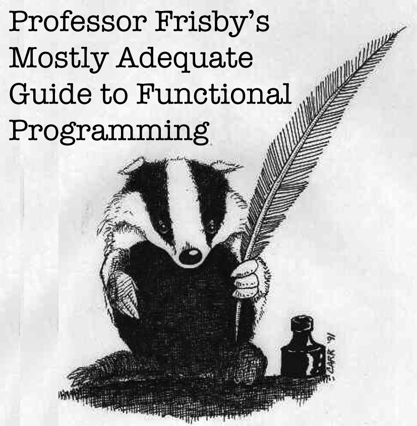

[](SUMMARY.md)

## About this book

This is a book on the functional paradigm in general. We'll use the world's most popular functional programming language: JavaScript. Some may feel this is a poor choice as it's against the grain of the current culture which, at the moment, feels predominately imperative. However, I believe it is the best way to learn FP for several reasons:

 * **You likely use it every day at work.**

    This makes it possible to practice and apply your acquired knowledge each day on real world programs rather than pet projects on nights and weekends in an esoteric FP language.


 * **We don't have to learn everything up front to start writing programs.**

    In a pure functional language, you cannot log a variable or read a DOM node without using monads. Here we can cheat a little as we learn to purify our codebase. It's also easier to get started in this language since it's mixed paradigm and you can fall back on your current practices while there are gaps in your knowledge.


 * **The language is fully capable of writing top notch functional code.**

    We have all the features we need to mimic a language like Scala or Haskell with the help of a tiny library or two. Object-oriented programming currently dominates the industry, but it's clearly awkward in JavaScript. It's akin to camping off of a highway or tap dancing in galoshes. We have to `bind` all over the place lest `this` change out from under us, we don't have classes(Yet), we have various work arounds for the quirky behavior when the `new` keyword is forgotten, private members are only available via closures. To a lot of us, FP feels more natural anyways.

That said, typed functional languages will, without a doubt, be the best place to code in the style presented by this book. JavaScript will be our means of learning a paradigm, where you apply it is up to you. Luckily, the interfaces are mathematical and, as such, ubiquitous. You'll find yourself at home with swiftz, scalaz, haskell, purescript, and other mathematically inclined environments.


### Gitbook (for a better reading experience)

* [Read it online](https://drboolean.gitbooks.io/mostly-adequate-guide/content/)
* [Download EPUB](https://www.gitbook.com/download/epub/book/drboolean/mostly-adequate-guide)
* [Download Mobi (Kindle)](https://www.gitbook.com/download/mobi/book/drboolean/mostly-adequate-guide)

### Do it yourself

```
git clone https://github.com/DrBoolean/mostly-adequate-guide.git

cd mostly-adequate-guide/
npm install gitbook-cli -g
gitbook init

brew update
brew install Caskroom/cask/calibre

gitbook mobi . ./functional.mobi
```


# Table of Contents

See [SUMMARY.md](SUMMARY.md)

### Contributing

See [CONTRIBUTING.md](CONTRIBUTING.md)

### Translations

See [TRANSLATIONS.md](TRANSLATIONS.md)

### FAQ

See [FAQ.md](FAQ.md)


# Plans for the future

* **Part 1** (currently chapters 1-7) is a guide to the basics. I'm updating as I find errors since this is the initial draft. Feel free to help!
* **Part 2** (currently chapters 8+) will address type classes like functors and monads all the way through to traversable. I hope to squeeze in transformers and a pure application.
* **Part 3** will start to dance the fine line between practical programming and academic absurdity. We'll look at comonads, f-algebras, free monads, yoneda, and other categorical constructs.
