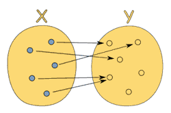
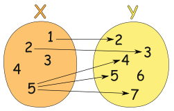
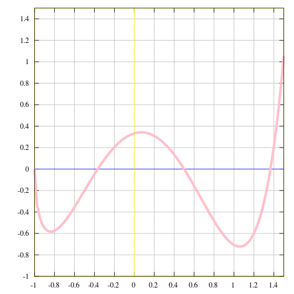

# Chapter 03: Pure Happiness with Pure Functions

## Oh to Be Pure Again

One thing we need to get straight is the idea of a pure function.

>A pure function is a function that, given the same input, will always return the same output and does not have any observable side effect.

Take `slice` and `splice`. They are two functions that do the exact same thing - in a vastly different way, mind you, but the same thing nonetheless. We say `slice` is *pure* because it returns the same output per input every time, guaranteed. `splice`, however, will chew up its array and spit it back out forever changed which is an observable effect.

```js
const xs = [1,2,3,4,5];

// pure
xs.slice(0,3); // [1,2,3]

xs.slice(0,3); // [1,2,3]

xs.slice(0,3); // [1,2,3]


// impure
xs.splice(0,3); // [1,2,3]

xs.splice(0,3); // [4,5]

xs.splice(0,3); // []
```

In functional programming, we dislike unwieldy functions like `splice` that *mutate* data. This will never do as we're striving for reliable functions that return the same result every time, not functions that leave a mess in their wake like `splice`.

Let's look at another example.

```js
// impure
let minimum = 21;
const checkAge = age => age >= minimum;

// pure
const checkAge = (age) => {
  const minimum = 21;
  return age >= minimum;
};
```

In the impure portion, `checkAge` depends on the mutable variable `minimum` to determine the result. In other words, it depends on system state which is disappointing because it increases the [cognitive load](https://en.wikipedia.org/wiki/Cognitive_load) by introducing an external environment.

It might not seem like a lot in this example, but this reliance upon state is one of the largest contributors to system complexity (http://curtclifton.net/papers/MoseleyMarks06a.pdf). This `checkAge` may return different results depending on factors external to input, which not only disqualifies it from being pure, but also puts our minds through the wringer each time we're reasoning about the software.

Its pure form, on the other hand, is completely self sufficient. We can  also make `minimum` immutable, which preserves the purity as the state will never change. To do this, we must create an object to freeze.

```js
const immutableState = Object.freeze({ minimum: 21 });
```

## Side Effects May Include...

Let's look more at these "side effects" to improve our intuition. So what is this undoubtedly nefarious *side effect* mentioned in the definition of *pure function*? We'll be referring to *effect* as anything that occurs in our computation other than the calculation of a result.

There's nothing intrinsically bad about effects and we'll be using them all over the place in the chapters to come. It's that *side* part that bears the negative connotation. Water alone is not an inherent larvae incubator, it's the *stagnant* part that yields the swarms, and I assure you, *side* effects are a similar breeding ground in your own programs.

>A *side effect* is a change of system state or *observable interaction* with the outside world that occurs during the calculation of a result.

Side effects may include, but are not limited to

  * changing the file system
  * inserting a record into a database
  * making an http call
  * mutations
  * printing to the screen / logging
  * obtaining user input
  * querying the DOM
  * accessing system state

And the list goes on and on. Any interaction with the world outside of a function is a side effect, which is a fact that may prompt you to suspect the practicality of programming without them. The philosophy of functional programming postulates that side effects are a primary cause of incorrect behavior.

It is not that we're forbidden to use them, rather we want to contain them and run them in a controlled way. We'll learn how to do this when we get to functors and monads in later chapters, but for now, let's try to keep these insidious functions separate from our pure ones.

Side effects disqualify a function from being *pure*. And it makes sense: pure functions, by definition, must always return the same output given the same input, which is not possible to guarantee when dealing with matters outside our local function.

Let's take a closer look at why we insist on the same output per input. Pop your collars, we're going to look at some 8th grade math.

## 8th Grade Math

From mathisfun.com:

> A function is a special relationship between values:
> Each of its input values gives back exactly one output value.

In other words, it's just a relation between two values: the input and the output. Though each input has exactly one output, that output doesn't necessarily have to be unique per input. Below shows a diagram of a perfectly valid function from `x` to `y`;

(https://www.mathsisfun.com/sets/function.html)

To contrast, the following diagram shows a relation that is *not* a function since the input value `5` points to several outputs:

(https://www.mathsisfun.com/sets/function.html)

Functions can be described as a set of pairs with the position (input, output): `[(1,2), (3,6), (5,10)]` (It appears this function doubles its input).

Or perhaps a table:
<table> <tr> <th>Input</th> <th>Output</th> </tr> <tr> <td>1</td> <td>2</td> </tr> <tr> <td>2</td> <td>4</td> </tr> <tr> <td>3</td> <td>6</td> </tr> </table>

Or even as a graph with `x` as the input and `y` as the output:




There's no need for implementation details if the input dictates the output. Since functions are simply mappings of input to output, one could simply jot down object literals and run them with `[]` instead of `()`.

```js
const toLowerCase = {
  A: 'a',
  B: 'b',
  C: 'c',
  D: 'd',
  E: 'e',
  F: 'f',
};
toLowerCase['C']; // 'c'

const isPrime = {
  1: false,
  2: true,
  3: true,
  4: false,
  5: true,
  6: false,
};
isPrime[3]; // true
```

Of course, you might want to calculate instead of hand writing things out, but this illustrates a different way to think about functions. (You may be thinking "what about functions with multiple arguments?". Indeed, that presents a bit of an inconvenience when thinking in terms of mathematics. For now, we can bundle them up in an array or just think of the `arguments` object as the input. When we learn about *currying*, we'll see how we can directly model the mathematical definition of a function.)

Here comes the dramatic reveal: Pure functions *are* mathematical functions and they're what functional programming is all about. Programming with these little angels can provide huge benefits. Let's look at some reasons why we're willing to go to great lengths to preserve purity.

## The Case for Purity

### Cacheable

For starters, pure functions can always be cached by input. This is typically done using a technique called memoization:

```js
const squareNumber = memoize(x => x * x);

squareNumber(4); // 16

squareNumber(4); // 16, returns cache for input 4

squareNumber(5); // 25

squareNumber(5); // 25, returns cache for input 5
```

Here is a simplified implementation, though there are plenty of more robust versions available.

```js
const memoize = (f) => {
  const cache = {};

  return (...args) => {
    const argStr = JSON.stringify(args);
    cache[argStr] = cache[argStr] || f(...args);
    return cache[argStr];
  };
};
```

Something to note is that you can transform some impure functions into pure ones by delaying evaluation:

```js
const pureHttpCall = memoize((url, params) => () => $.getJSON(url, params));
```

The interesting thing here is that we don't actually make the http call - we instead return a function that will do so when called. This function is pure because it will always return the same output given the same input: the function that will make the particular http call given the `url` and `params`.

Our `memoize` function works just fine, though it doesn't cache the results of the http call, rather it caches the generated function.

This is not very useful yet, but we'll soon learn some tricks that will make it so. The takeaway is that we can cache every function no matter how destructive they seem.

### Portable / Self-documenting

Pure functions are completely self contained. Everything the function needs is handed to it on a silver platter. Ponder this for a moment... How might this be beneficial? For starters, a function's dependencies are explicit and therefore easier to see and understand - no funny business going on under the hood.

```js
// impure
const signUp = (attrs) => {
  const user = saveUser(attrs);
  welcomeUser(user);
};

// pure
const signUp = (Db, Email, attrs) => () => {
  const user = saveUser(Db, attrs);
  welcomeUser(Email, user);
};
```

The example here demonstrates that the pure function must be honest about its dependencies and, as such, tell us exactly what it's up to. Just from its signature, we know that it will use a `Db`, `Email`, and `attrs` which should be telling to say the least.

We'll learn how to make functions like this pure without merely deferring evaluation, but the point should be clear that the pure form is much more informative than its sneaky impure counterpart which is up to who knows what.

Something else to notice is that we're forced to "inject" dependencies, or pass them in as arguments, which makes our app much more flexible because we've parameterized our database or mail client or what have you (don't worry, we'll see a way to make this less tedious than it sounds). Should we choose to use a different Db we need only to call our function with it. Should we find ourselves writing a new application in which we'd like to reuse this reliable function, we simply give this function whatever `Db` and `Email` we have at the time.

In a JavaScript setting, portability could mean serializing and sending functions over a socket. It could mean running all our app code in web workers. Portability is a powerful trait.

Contrary to "typical" methods and procedures in imperative programming rooted deep in their environment via state, dependencies, and available effects, pure functions can be run anywhere our hearts desire.

When was the last time you copied a method into a new app? One of my favorite quotes comes from Erlang creator, Joe Armstrong: "The problem with object-oriented languages is they’ve got all this implicit environment that they carry around with them. You wanted a banana but what you got was a gorilla holding the banana... and the entire jungle".

### Testable

Next, we come to realize pure functions make testing much easier. We don't have to mock a "real" payment gateway or setup and assert the state of the world after each test. We simply give the function input and assert output.

In fact, we find the functional community pioneering new test tools that can blast our functions with generated input and assert that properties hold on the output. It's beyond the scope of this book, but I strongly encourage you to search for and try *Quickcheck* - a testing tool that is tailored for a purely functional environment.

### Reasonable

Many believe the biggest win when working with pure functions is *referential transparency*. A spot of code is referentially transparent when it can be substituted for its evaluated value without changing the behavior of the program.

Since pure functions don't have side effects, they can only influence the behavior of a program through their output values. Furthermore, since their output values can reliably be calculated using only their input values, pure functions will always preserve referential transparency. Let's see an example.


```js
const { Map } = require('immutable');

// Aliases: p = player, a = attacker, t = target
const jobe = Map({ name: 'Jobe', hp: 20, team: 'red' });
const michael = Map({ name: 'Michael', hp: 20, team: 'green' });
const decrementHP = p => p.set('hp', p.get('hp') - 1);
const isSameTeam = (p1, p2) => p1.get('team') === p2.get('team');
const punch = (a, t) => (isSameTeam(a, t) ? t : decrementHP(t));

punch(jobe, michael); // Map({name:'Michael', hp:19, team: 'green'})
```

`decrementHP`, `isSameTeam` and `punch` are all pure and therefore referentially transparent. We can use a technique called *equational reasoning* wherein one substitutes "equals for equals" to reason about code. It's a bit like manually evaluating the code without taking into account the quirks of programmatic evaluation. Using referential transparency, let's play with this code a bit.

First we'll inline the function `isSameTeam`.

```js
const punch = (a, t) => (a.get('team') === t.get('team') ? t : decrementHP(t));
```

Since our data is immutable, we can simply replace the teams with their actual value

```js
const punch = (a, t) => ('red' === 'green' ? t : decrementHP(t));
```

We see that it is false in this case so we can remove the entire if branch

```js
const punch = (a, t) => decrementHP(t);
```

And if we inline `decrementHP`, we see that, in this case, punch becomes a call to decrement the `hp` by 1.

```js
const punch = (a, t) => t.set('hp', t.get('hp') - 1);
```

This ability to reason about code is terrific for refactoring and understanding code in general. In fact, we used this technique to refactor our flock of seagulls program. We used equational reasoning to harness the properties of addition and multiplication. Indeed, we'll be using these techniques throughout the book.

### Parallel Code

Finally, and here's the coup de grâce, we can run any pure function in parallel since it does not need access to shared memory and it cannot, by definition, have a race condition due to some side effect.

This is very much possible in a server side js environment with threads as well as in the browser with web workers though current culture seems to avoid it due to complexity when dealing with impure functions.


## In Summary

We've seen what pure functions are and why we, as functional programmers, believe they are the cat's evening wear. From this point on, we'll strive to write all our functions in a pure way. We'll require some extra tools to help us do so, but in the meantime, we'll try to separate the impure functions from the rest of the pure code.

Writing programs with pure functions is a tad laborious without some extra tools in our belt. We have to juggle data by passing arguments all over the place, we're forbidden to use state, not to mention effects. How does one go about writing these masochistic programs? Let's acquire a new tool called curry.

[Chapter 04: Currying](ch04.md)
