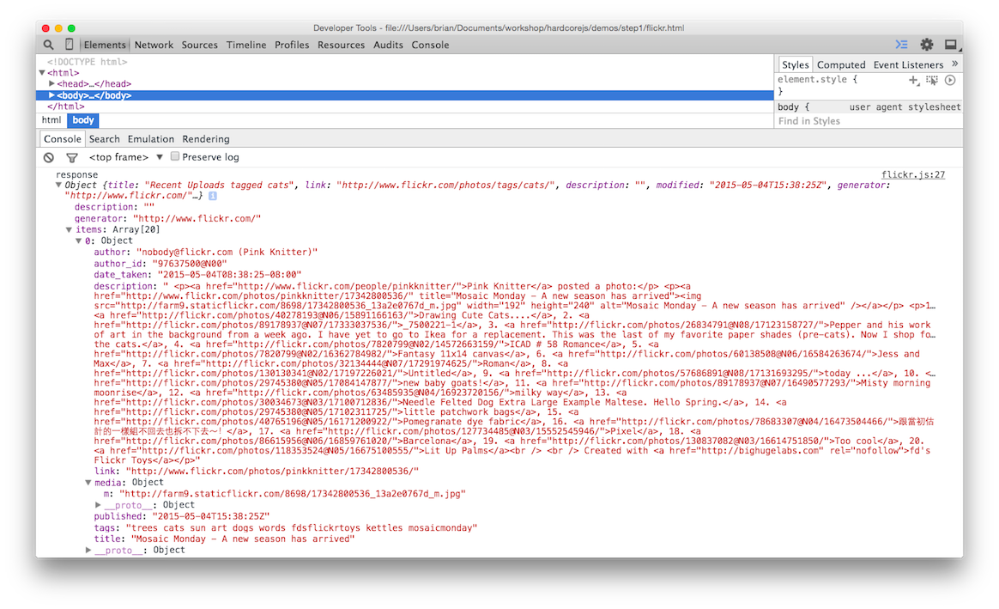
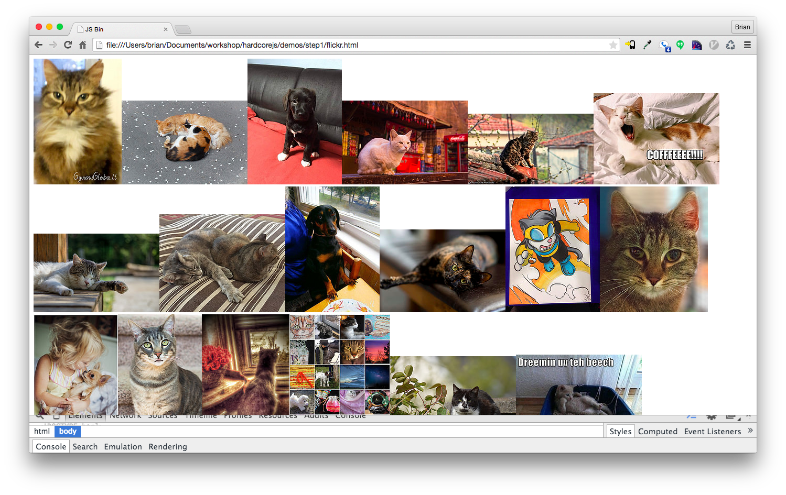

# Chapter 06: 範例應用程式

## 陳述式程式碼

> 註解：
> Declarative 大部分被譯為 宣告式 或是 聲明式，
> 但其哈囉認為此詞更好的翻譯是 陳述式，更接近原文原意。

從現在起，我們將要開始改變思維模式。
我們將停止告訴電腦如何完成他的工作，
轉而透過寫下規格來表示我們想要什麼樣的結果，
我可以保證，比起每次都要鉅細靡遺的考慮每件事，這會大大地減輕你的負擔。

陳述式，與之相對的就是 命令式，
就是我們將透過陳述的方式來取代一步接一步的指令。

像是 SQL,
並非像 "首先做這個，再來做那個" 的操作方式，
而是陳述了你想要對資料庫做些什麼，
我們並沒有幫他決定要如何達成這件事，他自己可以決定。
所以當資料庫升級 或是 SQL 引擎優化，我們都不需要動到 query。
那是因為有很多種方法，既可以解析我們的規格也可以達成相同結果。

這對於剛開始接觸的人，也包含我，
很難一開始就駕馭陳述式的寫作風格，
所以我們需要透過一些範例來感受一下。

```js
// imperative
const makes = [];
for (let i = 0; i < cars.length; i += 1) {
  makes.push(cars[i].make);
}

// declarative
const makes = cars.map((car) => car.make);
```

命令式的迴圈需要先申明初始化陣列。
再繼續往下之前編譯器需要先執行這段初始化。
然後它會直接迭代過清單裡的所有的 car，
並手動增加計數器，並把各種哩哩摳摳的東西都露骨的展示出來。

`map` 的版本就是一個表達式。
它並不依賴於執行順序。
這給於 `map` 如何進行迭代跟回傳陣列提供了極高的自由度。
他只表示了 _做了什麼 what_，而非 _怎麼做 how_。
所以，它是正港的陳述式。

除了程式更清楚跟簡潔之外，`map` 也可以在無需改動過多程式碼，做更進一步的優化。

至於那些説著 "對，但命令式迴圈速度要快得多。" 的人，
我建議你們可以先去學一下 JIT 是如何優化程式碼的相關知識。
這邊提供 [非常棒的影片](https://www.youtube.com/watch?v=g0ek4vV7nEA)，
可能會對你有幫助。

> **註解**
> 上面說的 JIT 優化，簡單來說是指，
> 其實你的 JS 程式碼在實際的 runtime 還會再優化一次，
> 所有函式在進到實際執行階段之前，會先編譯同時會進行優化，hoisting 跟記憶體配置也是在這個階段，
> 這是為了 runtime 的執行效率，這是現行每一套程式語言都會做的事情，
> 其中幾個比較著名的優化手法，像是 inline，constant propagation，loop invariant code motion，
> 都有被記載在 v8 跟 wiki 上。

來看另一個例子。

```js
// imperative
const authenticate = (form) => {
  const user = toUser(form);
  return logIn(user);
};

// declarative
const authenticate = compose(logIn, toUser);
```

雖然撰寫命令式的版本並不表示他一定是錯的，
但他還是硬寫了一步接一步的執行方式。
而 `compose` 表達式只是簡單的指出了一個事實：驗證就是 `toUser` 跟 `logIn` 兩者的結合。
再一次，這提供了我們改寫程式碼的彈性，而我們撰寫的應用程式程式碼就是一種高階規格。

在上面的範例中，
雖然有定義執行順序 (`toUser` 必須在 `logIn` 之前)，
但大部分的情境是順序並不重要，
而這在陳述式的寫法很容易達成(後面示範更多)。

因為我們無需硬寫下執行順序，陳述式的程式讓我們更容易進行平行運算。
他與純函式一起解釋了為何函式編程是未來平行運算的好選擇 -
我們真的不需要特別做些什麼就能做出 平行 / 併發 的系統。

## A Flickr of Functional Programming

我們現在將要用陳述跟組合的方式打造一個範例程式。
我們現在還是會使用到一些 side effects，但我們會盡可能讓其保持最少以及跟純粹的程式碼區分開來。
接下來要做一個瀏覽器小工具會從 flickr 上擷取圖片並在頁面上顯示。
先讓我們從 html 開始：

```html
<!DOCTYPE html>
<html lang="en">
  <head>
    <meta charset="utf-8" />
    <title>Flickr App</title>
  </head>
  <body>
    <main id="js-main" class="main"></main>
    <script src="https://cdnjs.cloudflare.com/ajax/libs/require.js/2.2.0/require.min.js"></script>
    <script src="main.js"></script>
  </body>
</html>
```

這是我們的 main.js ：

```js
const CDN = (s) => `https://cdnjs.cloudflare.com/ajax/libs/${s}`;
const ramda = CDN("ramda/0.21.0/ramda.min");
const jquery = CDN("jquery/3.0.0-rc1/jquery.min");

requirejs.config({ paths: { ramda, jquery } });
requirejs(["jquery", "ramda"], ($, { compose, curry, map, prop }) => {
  // app goes here
});
```

我們使用 [ramda](https://ramdajs.com) 取代 lodash 或其他類似的工具函式庫。
它包含了向 `compose` 或是 `curry` 之類的函式。
我們會使用 requirejs 儘管有點殺雞用牛刀，
但為了保持一致性，整本書都會使用它。

言歸正傳，我們的 app 將會做 4 件事：

1. 根據特定的搜尋關鍵字建構 url
2. 打 flickr 的 api
3. 將 json 結果轉為 html 圖片
4. 輸出到畫面上

注意到了嗎？上面我們提到有兩個不純的動作。
就是從 flickr 的 api 取得資料以及將他配置到畫面上。
我們先來定義這兩個動作，方便我們隔離他們。
並且，我會先把 `trace` 函式加上方便我們除錯。

```js
const Impure = {
  getJSON: curry((callback, url) => $.getJSON(url, callback)),
  setHtml: curry((sel, html) => $(sel).html(html)),
  trace: curry((tag, x) => {
    console.log(tag, x);
    return x;
  }),
};
```

這邊我們先簡單的把 jQuery 的函式 curry 化，並調整成我們喜歡的參數順序。
把他們都放置在 `Impure` 的命名空間底下，讓我們知道這些都是危險函式。
在未來的範例，我們將會讓這兩個函式變純函式。

接下來我們要建構 url 並拋進 `Impure.getJSON` 函式。

```js
const host = "api.flickr.com";
const path = "/services/feeds/photos_public.gne";
const query = (t) => `?tags=${t}&format=json&jsoncallback=?`;
const url = (t) => `https://${host}${path}${query(t)}`;
```

其實可以用 monoids 或是 combinators 這類很炫砲但很複雜的的方式來把 `url` 函式寫成 pointfree。
但為了可讀性，這邊我們選擇用普通的 pointful 方式組合字串。

讓我們寫一個 `app` 函式，來發送請求並把內容輸出到畫面上。

```js
const app = compose(Impure.getJSON(Impure.trace("response")), url);
app("cats");
```

這會執行 `url` 函式，並把字串傳給 `getJSON` 函式，
而 `getJSON` 已經局部調用了 `trace` 函式了。
載入這個 app 將會把 api 的結果顯示在 console 上。



我们想要從透過這個 json 來建立圖片，
看起来 `mediaUrls` 都在 `items` 中的每个 `media` 的 `m` 屬性上。

不論如何，為了取得巢狀屬性資料，
我們要使用 ramda 中一個方便且通用性高的 getter 函式叫做 `prop`。
不過為了讓你清楚細節，我們先自己實作一個出來。

```js
const prop = curry((property, object) => object[property]);
```

其實這有點蠢，
就只是為了用 `[]` 去取得任意物件的屬性。
開始用它來取得我們的 `mediaUrls` 吧。

```js
const mediaUrl = compose(prop("m"), prop("media"));
const mediaUrls = compose(map(mediaUrl), prop("items"));
```

當我們取得 `items` 時，我們需要用 `map` 來逐一取得每個 url。
其結果就是得到 `mediaUrls` 陣列。
把它跟 app 連接起來，將結果印出來看看。

```js
const render = compose(Impure.setHtml("#js-main"), mediaUrls);
const app = compose(Impure.getJSON(render), url);
```

這邊做的就是為了做出一個新的組合，
他負責執行我們的 `mediaUrls` 函式並將結果輸出到 `<main>` html。
我們將 `trace` 換成 `render` 表示我們要透過純 json 渲染某些東西到畫面。
這將會粗獷的將 `mediaUrls` 全都輸出到畫面。

最後就是把 `mediaUrls` 綁到 `images` 上。
在大型的應用程式，我們會透過一些 template/dom 函式庫像是 Handlebars 或 React 來處理這段。
在這邊，我們只需要 img tag 所以用 jQuery 就可以了。

```js
const img = (src) => $("", { src });
```

jQuery 的 `html` 方法可以接收一組 tags。
我們只需要把轉換過的 mediaUrls images 送進 `setHtml` 即可。

```js
const images = compose(map(img), mediaUrls);
const render = compose(Impure.setHtml("#js-main"), images);
const app = compose(Impure.getJSON(render), url);
```

我們完成了！



這邊是完整的程式碼：
[include](./exercises/ch06/main.js)

來看看。
多們漂亮的陳述式典範，我們只講做什麼，不囉唆怎麼做。
現在我們可以把每行當作一個跟執行綁定的等式，
透過這些等式，可以反過來了解我們的應用程式跟重構。

## 有原則的重構

上面的程式是有優化空間的，我們為了取得 media url 執行了 map 一次，
然後為了將 mediaUrls 轉成 img tags 又 map 了一次。
這邊有辦法套用結合律。

```js
// map's composition law
compose(map(f), map(g)) === map(compose(f, g));
```

我們可以利用這個特性來優化程式碼。
現在來重構看看。

```js
// original code
const mediaUrl = compose(prop("m"), prop("media"));
const mediaUrls = compose(map(mediaUrl), prop("items"));
const images = compose(map(img), mediaUrls);
```

透過 等式推導 跟 純函式 的特性，
我們可以把 `mediaUrls` 直接寫在 `images`。

```js
const mediaUrl = compose(prop("m"), prop("media"));
const images = compose(map(img), map(mediaUrl), prop("items"));
```

現在讓我們將 `map` 並成一行，方便調用 結合律。

```js
/*
compose(map(f), map(g)) === map(compose(f, g));
compose(map(img), map(mediaUrl)) === map(compose(img, mediaUrl));
*/

const mediaUrl = compose(prop("m"), prop("media"));
const images = compose(map(compose(img, mediaUrl)), prop("items"));
```

現在只要執行迴圈一次就可以將每個物件轉成 img 了。
再來將函式抽出就能再提升點可讀性。

```js
const mediaUrl = compose(prop("m"), prop("media"));
const mediaToImg = compose(img, mediaUrl);
const images = compose(map(mediaToImg), prop("items"));
```

## 總結

我們已經看到如何透過這些新技巧來打造一個小型但是真實的應用程式。
也看到我們如何透過數學框架的技巧來推導跟重構程式碼。
但是要怎麼處理錯誤，跟程式邏輯分支呢？
我們要如何讓整個應用程式純淨而不是透過將有破壞性的函式推到一邊？
如何讓應用程式更安全且有表現力？
這些都是本書第二部分要討論的主題。

[Chapter 07: Hindley-Milner 與 我](ch07.md)
