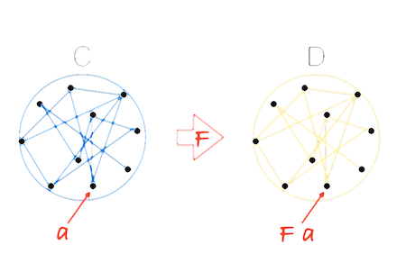
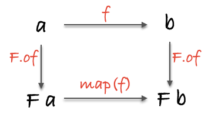
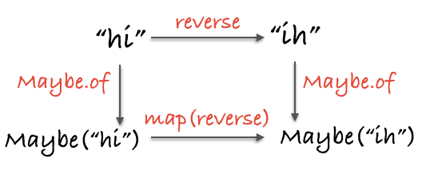

# Chapter 08: Tupperware

## The Mighty Container


We've seen how to write programs which pipe data through a series of pure functions. They are declarative specifications of behaviour. But what about control flow, error handling, asynchronous actions, state and, dare I say, effects?! In this chapter, we will discover the foundation upon which all of these helpful abstractions are built.

First we will create a container. This container must hold any type of value; a ziplock that holds only tapioca pudding is rarely useful. It will be an object, but we will not give it properties and methods in the OO sense. No, we will treat it like a treasure chest - a special box that cradles our valuable data.

```js
class Container {
  constructor(x) {
    this.$value = x;
  }
  
  static of(x) {
    return new Container(x);
  }
}
```

Here is our first container. We've thoughtfully named it `Container`. We will use `Container.of` as a constructor which saves us from having to write that awful `new` keyword all over the place. There's more to the `of` function than meets the eye, but for now, think of it as the proper way to place values into our container.

Let's examine our brand new box...

```js
Container.of(3);
// Container(3)

Container.of('hotdogs');
// Container("hotdogs")

Container.of(Container.of({ name: 'yoda' }));
// Container(Container({ name: 'yoda' }))
```

If you are using node, you will see `{$value: x}` even though we've got ourselves a `Container(x)`. Chrome will output the type properly, but no matter; as long as we understand what a `Container` looks like, we'll be fine. In some environments you can overwrite the `inspect` method if you'd like, but we will not be so thorough. For this book, we will write the conceptual output as if we'd overwritten `inspect` as it's much more instructive than `{$value: x}` for pedagogical as well as aesthetic reasons.

Let's make a few things clear before we move on:

* `Container` is an object with one property. Lots of containers just hold one thing, though they aren't limited to one. We've arbitrarily named its property `$value`.

* The `$value` cannot be one specific type or our `Container` would hardly live up to the name.

* Once data goes into the `Container` it stays there. We *could* get it out by using `.$value`, but that would defeat the purpose.

The reasons we're doing this will become clear as a mason jar, but for now, bear with me.

## My First Functor

Once our value, whatever it may be, is in the container, we'll need a way to run functions on it.

```js
// (a -> b) -> Container a -> Container b
Container.prototype.map = function (f) {
  return Container.of(f(this.$value));
};
```

Why, it's just like Array's famous `map`, except we have `Container a` instead of `[a]`. And it works essentially the same way:

```js
Container.of(2).map(two => two + 2); 
// Container(4)

Container.of('flamethrowers').map(s => s.toUpperCase()); 
// Container('FLAMETHROWERS')

Container.of('bombs').map(append(' away')).map(prop('length')); 
// Container(10)
```

We can work with our value without ever having to leave the `Container`. This is a remarkable thing. Our value in the `Container` is handed to the `map` function so we can fuss with it and afterward, returned to its `Container` for safe keeping. As a result of never leaving the `Container`, we can continue to `map` away, running functions as we please. We can even change the type as we go along as demonstrated in the latter of the three examples.

Wait a minute, if we keep calling `map`, it appears to be some sort of composition! What mathematical magic is at work here? Well chaps, we've just discovered *Functors*.

> A Functor is a type that implements `map` and obeys some laws

Yes, *Functor* is simply an interface with a contract. We could have just as easily named it *Mappable*, but now, where's the *fun* in that? Functors come from category theory and we'll look at the maths in detail toward the end of the chapter, but for now, let's work on intuition and practical uses for this bizarrely named interface.

What reason could we possibly have for bottling up a value and using `map` to get at it? The answer reveals itself if we choose a better question: What do we gain from asking our container to apply functions for us? Well, abstraction of function application. When we `map` a function, we ask the container type to run it for us. This is a very powerful concept, indeed.

## Schrödinger's Maybe


`Container` is fairly boring. In fact, it is usually called `Identity` and has about the same impact as our `id` function (again there is a mathematical connection we'll look at when the time is right). However, there are other functors, that is, container-like types that have a proper `map` function, which can provide useful behaviour whilst mapping. Let's define one now.

> A complete implementation is given in the [Appendix B](./appendix_b.md#Maybe)

```js
class Maybe {
  static of(x) {
    return new Maybe(x);
  }

  get isNothing() {
    return this.$value === null || this.$value === undefined;
  }

  constructor(x) {
    this.$value = x;
  }

  map(fn) {
    return this.isNothing ? this : Maybe.of(fn(this.$value));
  }

  inspect() {
    return this.isNothing ? 'Nothing' : `Just(${inspect(this.$value)})`;
  }
}
```

Now, `Maybe` looks a lot like `Container` with one minor change: it will first check to see if it has a value before calling the supplied function. This has the effect of side stepping those pesky nulls as we `map`(Note that this implementation is simplified for teaching).

```js
Maybe.of('Malkovich Malkovich').map(match(/a/ig));
// Just(True)

Maybe.of(null).map(match(/a/ig));
// Nothing

Maybe.of({ name: 'Boris' }).map(prop('age')).map(add(10));
// Nothing

Maybe.of({ name: 'Dinah', age: 14 }).map(prop('age')).map(add(10));
// Just(24)
```

Notice our app doesn't explode with errors as we map functions over our null values. This is because `Maybe` will take care to check for a value each and every time it applies a function.

This dot syntax is perfectly fine and functional, but for reasons mentioned in Part 1, we'd like to maintain our pointfree style. As it happens, `map` is fully equipped to delegate to whatever functor it receives:

```js
// map :: Functor f => (a -> b) -> f a -> f b
const map = curry((f, anyFunctor) => anyFunctor.map(f));
```

This is delightful as we can carry on with composition per usual and `map` will work as expected. This is the case with ramda's `map` as well. We'll use dot notation when it's instructive and the pointfree version when it's convenient. Did you notice that? I've sneakily introduced extra notation into our type signature. The `Functor f =>` tells us that `f` must be a Functor. Not that difficult, but I felt I should mention it.

## Use Cases

In the wild, we'll typically see `Maybe` used in functions which might fail to return a result.

```js
// safeHead :: [a] -> Maybe(a)
const safeHead = xs => Maybe.of(xs[0]);

// streetName :: Object -> Maybe String
const streetName = compose(map(prop('street')), safeHead, prop('addresses'));

streetName({ addresses: [] });
// Nothing

streetName({ addresses: [{ street: 'Shady Ln.', number: 4201 }] });
// Just('Shady Ln.')
```

`safeHead` is like our normal `head`, but with added type safety. A curious thing happens when `Maybe` is introduced into our code; we are forced to deal with those sneaky `null` values. The `safeHead` function is honest and up front about its possible failure - there's really nothing to be ashamed of - and so it returns a `Maybe` to inform us of this matter. We are more than merely *informed*, however, because we are forced to `map` to get at the value we want since it is tucked away inside the `Maybe` object. Essentially, this is a `null` check enforced by the `safeHead` function itself. We can now sleep better at night knowing a `null` value won't rear its ugly, decapitated head when we least expect it. APIs like this will upgrade a flimsy application from paper and tacks to wood and nails. They will guarantee safer software.


Sometimes a function might return a `Nothing` explicitly to signal failure. For instance:

```js
// withdraw :: Number -> Account -> Maybe(Account)
const withdraw = curry((amount, { balance }) =>
  Maybe.of(balance >= amount ? { balance: balance - amount } : null));

// This function is hypothetical, not implemented here... nor anywhere else.
// updateLedger :: Account -> Account 
const updateLedger = account => account;

// remainingBalance :: Account -> String
const remainingBalance = ({ balance }) => `Your balance is $${balance}`;

// finishTransaction :: Account -> String
const finishTransaction = compose(remainingBalance, updateLedger);


// getTwenty :: Account -> Maybe(String)
const getTwenty = compose(map(finishTransaction), withdraw(20));

getTwenty({ balance: 200.00 }); 
// Just('Your balance is $180')

getTwenty({ balance: 10.00 });
// Nothing
```

`withdraw` will tip its nose at us and return `Nothing` if we're short on cash. This function also communicates its fickleness and leaves us no choice, but to `map` everything afterwards. The difference is that the `null` was intentional here. Instead of a `Just('..')`, we get the `Nothing` back to signal failure and our application effectively halts in its tracks. This is important to note: if the `withdraw` fails, then `map` will sever the rest of our computation since it doesn't ever run the mapped functions, namely `finishTransaction`. This is precisely the intended behaviour as we'd prefer not to update our ledger or show a new balance if we hadn't successfully withdrawn funds.

## Releasing the Value

One thing people often miss is that there will always be an end of the line; some effecting function that sends JSON along, or prints to the screen, or alters our filesystem, or what have you. We cannot deliver the output with `return`, we must run some function or another to send it out into the world. We can phrase it like a Zen Buddhist koan: "If a program has no observable effect, does it even run?". Does it run correctly for its own satisfaction? I suspect it merely burns some cycles and goes back to sleep...

Our application's job is to retrieve, transform, and carry that data along until it's time to say goodbye and the function which does so may be mapped, thus the value needn't leave the warm womb of its container. Indeed, a common error is to try to remove the value from our `Maybe` one way or another as if the possible value inside will suddenly materialize and all will be forgiven. We must understand it may be a branch of code where our value is not around to live up to its destiny.  Our code, much like Schrödinger's cat, is in two states at once and should maintain that fact until the final function. This gives our code a linear flow despite the logical branching.

There is, however, an escape hatch. If we would rather return a custom value and continue on, we can use a little helper called `maybe`.

```js
// maybe :: b -> (a -> b) -> Maybe a -> b
const maybe = curry((v, f, m) => {
  if (m.isNothing) {
    return v;
  }

  return f(m.$value);
});

// getTwenty :: Account -> String
const getTwenty = compose(maybe('You\'re broke!', finishTransaction), withdraw(20));

getTwenty({ balance: 200.00 }); 
// 'Your balance is $180.00'

getTwenty({ balance: 10.00 }); 
// 'You\'re broke!'
```

We will now either return a static value (of the same type that `finishTransaction` returns) or continue on merrily finishing up the transaction sans `Maybe`. With `maybe`, we are witnessing the equivalent of an `if/else` statement whereas with `map`, the imperative analog would be: `if (x !== null) { return f(x) }`.

The introduction of `Maybe` can cause some initial discomfort. Users of Swift and Scala will know what I mean as it's baked right into the core libraries under the guise of `Option(al)`. When pushed to deal with `null` checks all the time (and there are times we know with absolute certainty the value exists), most people can't help but feel it's a tad laborious. However, with time, it will become second nature and you'll likely appreciate the safety. After all, most of the time it will prevent cut corners and save our hides.

Writing unsafe software is like taking care to paint each egg with pastels before hurling it into traffic; like building a retirement home with materials warned against by three little pigs. It will do us well to put some safety into our functions and `Maybe` helps us do just that.

I'd be remiss if I didn't mention that the "real" implementation will split `Maybe` into two types: one for something and the other for nothing. This allows us to obey parametricity in `map` so values like `null` and `undefined` can still be mapped over and the universal qualification of the value in a functor will be respected. You'll often see types like `Some(x) / None` or `Just(x) / Nothing` instead of a `Maybe` that does a `null` check on its value.

## Pure Error Handling


It may come as a shock, but `throw/catch` is not very pure. When an error is thrown, instead of returning an output value, we sound the alarms! The function attacks, spewing thousands of 0s and 1s like shields and spears in an electric battle against our intruding input. With our new friend `Either`, we can do better than to declare war on input, we can respond with a polite message. Let's take a look:

> A complete implementation is given in the [Appendix B](./appendix_b.md#Either)

```js
class Either {
  static of(x) {
    return new Right(x);
  }

  constructor(x) {
    this.$value = x;
  }
}

class Left extends Either {
  map(f) {
    return this;
  }

  inspect() {
    return `Left(${inspect(this.$value)})`;
  }
}

class Right extends Either {
  map(f) {
    return Either.of(f(this.$value));
  }

  inspect() {
    return `Right(${inspect(this.$value)})`;
  }
}

const left = x => new Left(x);
```

`Left` and `Right` are two subclasses of an abstract type we call `Either`. I've skipped the ceremony of creating the `Either` superclass as we won't ever use it, but it's good to be aware. Now then, there's nothing new here besides the two types. Let's see how they act:

```js
Either.of('rain').map(str => `b${str}`); 
// Right('brain')

left('rain').map(str => `It's gonna ${str}, better bring your umbrella!`); 
// Left('rain')

Either.of({ host: 'localhost', port: 80 }).map(prop('host'));
// Right('localhost')

left('rolls eyes...').map(prop('host'));
// Left('rolls eyes...')
```

`Left` is the teenagery sort and ignores our request to `map` over it. `Right` will work just like `Container` (a.k.a Identity). The power comes from the ability to embed an error message within the `Left`.

Suppose we have a function that might not succeed. How about we calculate an age from a birth date. We could use `Nothing` to signal failure and branch our program, however, that doesn't tell us much. Perhaps, we'd like to know why it failed. Let's write this using `Either`.

```js
const moment = require('moment');

// getAge :: Date -> User -> Either(String, Number)
const getAge = curry((now, user) => {
  const birthDate = moment(user.birthDate, 'YYYY-MM-DD');

  return birthDate.isValid()
    ? Either.of(now.diff(birthDate, 'years'))
    : left('Birth date could not be parsed');
});

getAge(moment(), { birthDate: '2005-12-12' });
// Right(9)

getAge(moment(), { birthDate: 'July 4, 2001' });
// Left('Birth date could not be parsed')
```

Now, just like `Nothing`, we are short-circuiting our app when we return a `Left`. The difference, is now we have a clue as to why our program has derailed. Something to notice is that we return `Either(String, Number)`, which holds a `String` as its left value and a `Number` as its `Right`. This type signature is a bit informal as we haven't taken the time to define an actual `Either` superclass, however, we learn a lot from the type. It informs us that we're either getting an error message or the age back.

```js
// fortune :: Number -> String
const fortune = compose(concat('If you survive, you will be '), toString, add(1));

// zoltar :: User -> Either(String, _)
const zoltar = compose(map(console.log), map(fortune), getAge(moment()));

zoltar({ birthDate: '2005-12-12' });
// 'If you survive, you will be 10'
// Right(undefined)

zoltar({ birthDate: 'balloons!' });
// Left('Birth date could not be parsed')
```

When the `birthDate` is valid, the program outputs its mystical fortune to the screen for us to behold. Otherwise, we are handed a `Left` with the error message plain as day though still tucked away in its container. That acts just as if we'd thrown an error, but in a calm, mild manner fashion as opposed to losing its temper and screaming like a child when something goes wrong.

In this example, we are logically branching our control flow depending on the validity of the birth date, yet it reads as one linear motion from right to left rather than climbing through the curly braces of a conditional statement. Usually, we'd move the `console.log` out of our `zoltar` function and `map` it at the time of calling, but it's helpful to see how the `Right` branch differs. We use `_` in the right branch's type signature to indicate it's a value that should be ignored (In some browsers you have to use `console.log.bind(console)` to use it first class).

I'd like to take this opportunity to point out something you may have missed: `fortune`, despite its use with `Either` in this example, is completely ignorant of any functors milling about. This was also the case with `finishTransaction` in the previous example. At the time of calling, a function can be surrounded by `map`, which transforms it from a non-functory function to a functory one, in informal terms. We call this process *lifting*. Functions tend to be better off working with normal data types rather than container types, then *lifted* into the right container as deemed necessary. This leads to simpler, more reusable functions that can be altered to work with any functor on demand.

`Either` is great for casual errors like validation as well as more serious, stop the show errors like missing files or broken sockets. Try replacing some of the `Maybe` examples with `Either` to give better feedback.

Now, I can't help but feel I've done `Either` a disservice by introducing it as merely a container for error messages. It captures logical disjunction (a.k.a `||`) in a type. It also encodes the idea of a *Coproduct* from category theory, which won't be touched on in this book, but is well worth reading up on as there's properties to be exploited. It is the canonical sum type (or disjoint union of sets) because its amount of possible inhabitants is the sum of the two contained types (I know that's a bit hand wavy so here's a [great article](https://www.schoolofhaskell.com/school/to-infinity-and-beyond/pick-of-the-week/sum-types)). There are many things `Either` can be, but as a functor, it is used for its error handling.

Just like with `Maybe`, we have little `either`, which behaves similarly, but takes two functions instead of one and a static value. Each function should return the same type:

```js
// either :: (a -> c) -> (b -> c) -> Either a b -> c
const either = curry((f, g, e) => {
  let result;

  switch (e.constructor) {
    case Left:
      result = f(e.$value);
      break;

    case Right:
      result = g(e.$value);
      break;

    // No Default
  }

  return result;
});

// zoltar :: User -> _
const zoltar = compose(console.log, either(id, fortune), getAge(moment()));

zoltar({ birthDate: '2005-12-12' });
// 'If you survive, you will be 10'
// undefined

zoltar({ birthDate: 'balloons!' });
// 'Birth date could not be parsed'
// undefined
```

Finally, a use for that mysterious `id` function. It simply parrots back the value in the `Left` to pass the error message to `console.log`. We've made our fortune-telling app more robust by enforcing error handling from within `getAge`. We either slap the user with a hard truth like a high five from a palm reader or we carry on with our process. And with that, we're ready to move on to an entirely different type of functor.

## Old McDonald Had Effects...


In our chapter about purity we saw a peculiar example of a pure function. This function contained a side-effect, but we dubbed it pure by wrapping its action in another function. Here's another example of this:

```js
// getFromStorage :: String -> (_ -> String)
const getFromStorage = key => () => localStorage[key];
```

Had we not surrounded its guts in another function, `getFromStorage` would vary its output depending on external circumstance. With the sturdy wrapper in place, we will always get the same output per input: a function that, when called, will retrieve a particular item from `localStorage`. And just like that (maybe throw in a few Hail Mary's) we've cleared our conscience and all is forgiven.

Except, this isn't particularly useful now is it. Like a collectible action figure in its original packaging, we can't actually play with it. If only there were a way to reach inside of the container and get at its contents... Enter `IO`.

```js
class IO {
  static of(x) {
    return new IO(() => x);
  }

  constructor(fn) {
    this.$value = fn;
  }

  map(fn) {
    return new IO(compose(fn, this.$value));
  }

  inspect() {
    return `IO(${inspect(this.$value)})`;
  }
}
```

`IO` differs from the previous functors in that the `$value` is always a function. We don't
think of its `$value` as a function, however - that is an implementation detail and we best
ignore it. What is happening is exactly what we saw with the `getFromStorage` example: `IO`
delays the impure action by capturing it in a function wrapper. As such, we think of `IO` as
containing the return value of the wrapped action and not the wrapper itself. This is apparent
in the `of` function: we have an `IO(x)`, the `IO(() => x)` is just necessary to
avoid evaluation. Note that, to simplify reading, we'll show the hypothetical value contained
in the `IO` as result; however in practice, you can't tell what this value is until you've
actually unleashed the effects!

Let's see it in use:

```js
// ioWindow :: IO Window
const ioWindow = new IO(() => window);

ioWindow.map(win => win.innerWidth);
// IO(1430)

ioWindow
  .map(prop('location'))
  .map(prop('href'))
  .map(split('/'));
// IO(['http:', '', 'localhost:8000', 'blog', 'posts'])


// $ :: String -> IO [DOM]
const $ = selector => new IO(() => document.querySelectorAll(selector));

$('#myDiv').map(head).map(div => div.innerHTML);
// IO('I am some inner html')
```

Here, `ioWindow` is an actual `IO` that we can `map` over straight away, whereas `$` is a function that returns an `IO` after it's called. I've written out the *conceptual* return values to better express the `IO`, though, in reality, it will always be `{ $value: [Function] }`. When we `map` over our `IO`, we stick that function at the end of a composition which, in turn, becomes the new `$value` and so on. Our mapped functions do not run, they get tacked on the end of a computation we're building up, function by function, like carefully placing dominoes that we don't dare tip over. The result is reminiscent of Gang of Four's command pattern or a queue.

Take a moment to channel your functor intuition. If we see past the implementation details, we should feel right at home mapping over any container no matter its quirks or idiosyncrasies. We have the functor laws, which we will explore toward the end of the chapter, to thank for this pseudo-psychic power. At any rate, we can finally play with impure values without sacrificing our precious purity.

Now, we've caged the beast, but we'll still have to set it free at some point. Mapping over our `IO` has built up a mighty impure computation and running it is surely going to disturb the peace. So where and when can we pull the trigger? Is it even possible to run our `IO` and still wear white at our wedding? The answer is yes, if we put the onus on the calling code. Our pure code, despite the nefarious plotting and scheming, maintains its innocence and it's the caller who gets burdened with the responsibility of actually running the effects. Let's see an example to make this concrete.

```js
// url :: IO String
const url = new IO(() => window.location.href);

// toPairs :: String -> [[String]]
const toPairs = compose(map(split('=')), split('&'));

// params :: String -> [[String]]
const params = compose(toPairs, last, split('?'));

// findParam :: String -> IO Maybe [String]
const findParam = key => map(compose(Maybe.of, find(compose(eq(key), head)), params), url);

// -- Impure calling code ----------------------------------------------

// run it by calling $value()!
findParam('searchTerm').$value();
// Just(['searchTerm', 'wafflehouse'])
```

Our library keeps its hands clean by wrapping `url` in an `IO` and passing the buck to the caller. You might have also noticed that we have stacked our containers; it's perfectly reasonable to have a `IO(Maybe([x]))`, which is three functors deep (`Array` is most definitely a mappable container type) and exceptionally expressive.

There's something that's been bothering me and we should rectify it immediately: `IO`'s `$value` isn't really its contained value, nor is it a private property. It is the pin in the grenade and it is meant to be pulled by a caller in the most public of ways. Let's rename this property to `unsafePerformIO` to remind our users of its volatility.

```js
class IO {
  constructor(io) {
    this.unsafePerformIO = io;
  }

  map(fn) {
    return new IO(compose(fn, this.unsafePerformIO));
  }
}
```

There, much better. Now our calling code becomes `findParam('searchTerm').unsafePerformIO()`, which is clear as day to users (and readers) of the application.

`IO` will be a loyal companion, helping us tame those feral impure actions. Next, we'll see a type similar in spirit, but having a drastically different use case.


## Asynchronous Tasks

Callbacks are the narrowing spiral staircase to hell. They are control flow as designed by M.C. Escher. With each nested callback squeezed in between the jungle gym of curly braces and parenthesis, they feel like limbo in an oubliette (how low can we go?!). I'm getting claustrophobic chills just thinking about them. Not to worry, we have a much better way of dealing with asynchronous code and it starts with an "F".

The internals are a bit too complicated to spill out all over the page here so we will use `Data.Task` (previously `Data.Future`) from Quildreen Motta's fantastic [Folktale](https://folktale.origamitower.com/). Behold some example usage:

```js
// -- Node readFile example ------------------------------------------

const fs = require('fs');

// readFile :: String -> Task Error String
const readFile = filename => new Task((reject, result) => {
  fs.readFile(filename, (err, data) => (err ? reject(err) : result(data)));
});

readFile('metamorphosis').map(split('\n')).map(head);
// Task('One morning, as Gregor Samsa was waking up from anxious dreams, he discovered that
// in bed he had been changed into a monstrous verminous bug.')


// -- jQuery getJSON example -----------------------------------------

// getJSON :: String -> {} -> Task Error JSON
const getJSON = curry((url, params) => new Task((reject, result) => {
  $.getJSON(url, params, result).fail(reject);
}));

getJSON('/video', { id: 10 }).map(prop('title'));
// Task('Family Matters ep 15')


// -- Default Minimal Context ----------------------------------------

// We can put normal, non futuristic values inside as well
Task.of(3).map(three => three + 1);
// Task(4)
```

The functions I'm calling `reject` and `result` are our error and success callbacks, respectively. As you can see, we simply `map` over the `Task` to work on the future value as if it was right there in our grasp. By now `map` should be old hat.

If you're familiar with promises, you might recognize the function `map` as `then` with `Task` playing the role of our promise. Don't fret if you aren't familiar with promises, we won't be using them anyhow because they are not pure, but the analogy holds nonetheless.

Like `IO`, `Task` will patiently wait for us to give it the green light before running. In fact, because it waits for our command, `IO` is effectively subsumed by `Task` for all things asynchronous; `readFile` and `getJSON` don't require an extra `IO` container to be pure. What's more, `Task` works in a similar fashion when we `map` over it: we're placing instructions for the future like a chore chart in a time capsule - an act of sophisticated technological procrastination.

To run our `Task`, we must call the method `fork`. This works like `unsafePerformIO`, but as the name suggests, it will fork our process and evaluation continues on without blocking our thread. This can be implemented in numerous ways with threads and such, but here it acts as a normal async call would and the big wheel of the event loop keeps on turning. Let's look at `fork`:

```js
// -- Pure application -------------------------------------------------
// blogPage :: Posts -> HTML
const blogPage = Handlebars.compile(blogTemplate);

// renderPage :: Posts -> HTML
const renderPage = compose(blogPage, sortBy(prop('date')));

// blog :: Params -> Task Error HTML
const blog = compose(map(renderPage), getJSON('/posts'));


// -- Impure calling code ----------------------------------------------
blog({}).fork(
  error => $('#error').html(error.message),
  page => $('#main').html(page),
);

$('#spinner').show();
```

Upon calling `fork`, the `Task` hurries off to find some posts and render the page. Meanwhile, we show a spinner since `fork` does not wait for a response. Finally, we will either display an error or render the page onto the screen depending if the `getJSON` call succeeded or not.

Take a moment to consider how linear the control flow is here. We just read bottom to top, right to left even though the program will actually jump around a bit during execution. This makes reading and reasoning about our application simpler than having to bounce between callbacks and error handling blocks.

Goodness, would you look at that, `Task` has also swallowed up `Either`! It must do so in order to handle futuristic failures since our normal control flow does not apply in the async world. This is all well and good as it provides sufficient and pure error handling out of the box.

Even with `Task`, our `IO` and `Either` functors are not out of a job. Bear with me on a quick example that leans toward the more complex and hypothetical side, but is useful for illustrative purposes.

```js
// Postgres.connect :: Url -> IO DbConnection
// runQuery :: DbConnection -> ResultSet
// readFile :: String -> Task Error String

// -- Pure application -------------------------------------------------

// dbUrl :: Config -> Either Error Url
const dbUrl = ({ uname, pass, host, db }) => {
  if (uname && pass && host && db) {
    return Either.of(`db:pg://${uname}:${pass}@${host}5432/${db}`);
  }

  return left(Error('Invalid config!'));
};

// connectDb :: Config -> Either Error (IO DbConnection)
const connectDb = compose(map(Postgres.connect), dbUrl);

// getConfig :: Filename -> Task Error (Either Error (IO DbConnection))
const getConfig = compose(map(compose(connectDb, JSON.parse)), readFile);


// -- Impure calling code ----------------------------------------------

getConfig('db.json').fork(
  logErr('couldn\'t read file'),
  either(console.log, map(runQuery)),
);
```

In this example, we still make use of `Either` and `IO` from within the success branch of `readFile`. `Task` takes care of the impurities of reading a file asynchronously, but we still deal with validating the config with `Either` and wrangling the db connection with `IO`. So you see, we're still in business for all things synchronous.

I could go on, but that's all there is to it. Simple as `map`.

In practice, you'll likely have multiple asynchronous tasks in one workflow and we haven't yet acquired the full container apis to tackle this scenario. Not to worry, we'll look at monads and such soon, but first, we must examine the maths that make this all possible.


## A Spot of Theory

As mentioned before, functors come from category theory and satisfy a few laws. Let's first explore these useful properties.

```js
// identity
map(id) === id;

// composition
compose(map(f), map(g)) === map(compose(f, g));
```

The *identity* law is simple, but important. These laws are runnable bits of code so we can try them on our own functors to validate their legitimacy.

```js
const idLaw1 = map(id);
const idLaw2 = id;

idLaw1(Container.of(2)); // Container(2)
idLaw2(Container.of(2)); // Container(2)
```

You see, they are equal. Next let's look at composition.

```js
const compLaw1 = compose(map(append(' world')), map(append(' cruel')));
const compLaw2 = map(compose(append(' world'), append(' cruel')));

compLaw1(Container.of('Goodbye')); // Container('Goodbye cruel world')
compLaw2(Container.of('Goodbye')); // Container('Goodbye cruel world')
```

In category theory, functors take the objects and morphisms of a category and map them to a different category. By definition, this new category must have an identity and the ability to compose morphisms, but we needn't check because the aforementioned laws ensure these are preserved.

Perhaps our definition of a category is still a bit fuzzy. You can think of a category as a network of objects with morphisms that connect them. So a functor would map the one category to the other without breaking the network. If an object `a` is in our source category `C`, when we map it to category `D` with functor `F`, we refer to that object as `F a` (If you put it together what does that spell?!). Perhaps, it's better to look at a diagram:



For instance, `Maybe` maps our category of types and functions to a category where each object may not exist and each morphism has a `null` check. We accomplish this in code by surrounding each function with `map` and each type with our functor. We know that each of our normal types and functions will continue to compose in this new world. Technically, each functor in our code maps to a sub category of types and functions which makes all functors a particular brand called endofunctors, but for our purposes, we'll think of it as a different category.

We can also visualize the mapping of a morphism and its corresponding objects with this diagram:



In addition to visualizing the mapped morphism from one category to another under the functor `F`, we see that the diagram commutes, which is to say, if you follow the arrows each route produces the same result. The different routes mean different behavior, but we always end at the same type. This formalism gives us principled ways to reason about our code - we can boldly apply formulas without having to parse and examine each individual scenario. Let's take a concrete example.

```js
// topRoute :: String -> Maybe String
const topRoute = compose(Maybe.of, reverse);

// bottomRoute :: String -> Maybe String
const bottomRoute = compose(map(reverse), Maybe.of);

topRoute('hi'); // Just('ih')
bottomRoute('hi'); // Just('ih')
```

Or visually:



We can instantly see and refactor code based on properties held by all functors.

Functors can stack:

```js
const nested = Task.of([Either.of('pillows'), left('no sleep for you')]);

map(map(map(toUpperCase)), nested);
// Task([Right('PILLOWS'), Left('no sleep for you')])
```

What we have here with `nested` is a future array of elements that might be errors. We `map` to peel back each layer and run our function on the elements. We see no callbacks, if/else's, or for loops; just an explicit context. We do, however, have to `map(map(map(f)))`. We can instead compose functors. You heard me correctly:

```js
class Compose {
  constructor(fgx) {
    this.getCompose = fgx;
  }

  static of(fgx) {
    return new Compose(fgx);
  }

  map(fn) {
    return new Compose(map(map(fn), this.getCompose));
  }
}

const tmd = Task.of(Maybe.of('Rock over London'));

const ctmd = Compose.of(tmd);

const ctmd2 = map(append(', rock on, Chicago'), ctmd);
// Compose(Task(Just('Rock over London, rock on, Chicago')))

ctmd2.getCompose;
// Task(Just('Rock over London, rock on, Chicago'))
```

There, one `map`. Functor composition is associative and earlier, we defined `Container`, which is actually called the `Identity` functor. If we have identity and associative composition we have a category. This particular category has categories as objects and functors as morphisms, which is enough to make one's brain perspire. We won't delve too far into this, but it's nice to appreciate the architectural implications or even just the simple abstract beauty in the pattern.


## In Summary

We've seen a few different functors, but there are infinitely many. Some notable omissions are iterable data structures like trees, lists, maps, pairs, you name it. Event streams and observables are both functors. Others can be for encapsulation or even just type modelling. Functors are all around us and we'll use them extensively throughout the book.

What about calling a function with multiple functor arguments? How about working with an order sequence of impure or async actions? We haven't yet acquired the full tool set for working in this boxed up world. Next, we'll cut right to the chase and look at monads.

[Chapter 09: Monadic Onions](ch09.md)

## Exercises

  
Use `add` and `map` to make a function that increments a value inside a functor.  
  
  
```js  
// incrF :: Functor f => f Int -> f Int  
const incrF = undefined;  
```  
  
  
  
  
  


---

  
Given the following User object:  
  
```js  
const user = { id: 2, name: 'Albert', active: true };  
```  
  
  
Use `safeProp` and `head` to find the first initial of the user.  
  
  
```js  
// initial :: User -> Maybe String  
const initial = undefined;  
```  
  
  
  
  
  


---


Given the following helper functions:

```js
// showWelcome :: User -> String
const showWelcome = compose(concat('Welcome '), prop('name'));

// checkActive :: User -> Either String User
const checkActive = function checkActive(user) {
  return user.active
    ? Either.of(user)
    : left('Your account is not active');
};
```

  
Write a function that uses `checkActive` and `showWelcome` to grant access or return the error.

  
```js
// eitherWelcome :: User -> Either String String
const eitherWelcome = undefined;
```


  
  
  
  


---


We now consider the following functions:

```js
// validateUser :: (User -> Either String ()) -> User -> Either String User
const validateUser = curry((validate, user) => validate(user).map(_ => user));

// save :: User -> IO User
const save = user => new IO(() => ({ ...user, saved: true }));
```

  
Write a function `validateName` which checks whether a user has a name longer than 3 characters
or return an error message. Then use `either`, `showWelcome` and `save` to write a `register`
function to signup and welcome a user when the validation is ok.

Remember either's two arguments must return the same type.

  
```js
// validateName :: User -> Either String ()
const validateName = undefined;

// register :: User -> IO String
const register = compose(undefined, validateUser(validateName));
```


  
  
  
  
