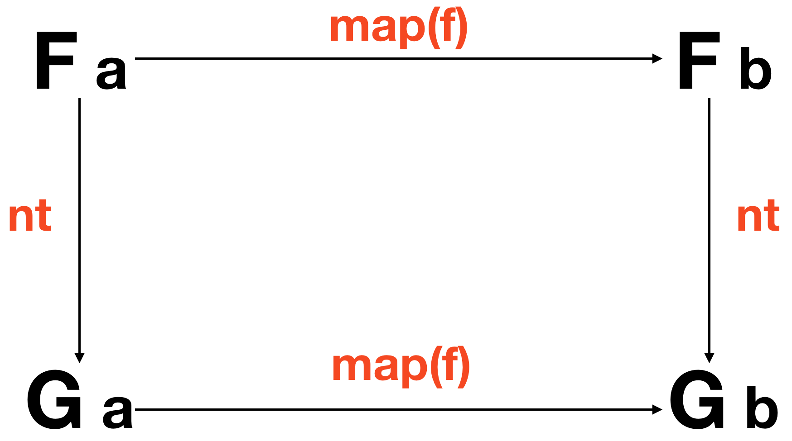

# Ch11: Transform Again, Naturally

We are about to discuss *natural transformations* in the context of practical utility in every day code. It just so happens they are a pillar of category theory and absolutely indispensable when applying mathematics to reason about and refactor our code. As such, I believe it is my duty to inform you about the lamentable injustice you are about to witness undoubtedly due to my limited scope. Let's begin.

## Curse this nest

I'd like to address the issue of nesting. Not the instinctive urge felt by soon to be mothers wherein they tidy and rearrange with obsessive compulsion, but the...well actually, come to think of it, that isn't far from the mark as we'll see in the coming chapters... In any case, what I mean by *nesting* is to have two or more different types all huddled together around a value, cradling it like a newborn, as it were.

```js
  Right(Maybe('b'))

  IO(Task(IO(1000)))

  [Identity('bee thousand')]
```

Until now, we've managed to evade this common scenario with carefully crafted examples, but in practice, as one codes, types tend to tangle themselves up like earbuds in an exorcism. If we don't meticulously keep our types organized as we go along, our code will read hairier than a beatnik in a cat café.

## A situational comedy

```js
// getValue :: Selector -> Task Error (Maybe String)
// postComment :: String -> Task Error Comment
// validate :: String -> Either ValidationError String

// saveComment :: () -> Task Error (Maybe (Either ValidationError (Task Error Comment)))
const saveComment = compose(map(map(map(postComment))), map(map(validate)), getValue('#comment'))
```

The gang is all here, much to our type signature's dismay. Allow me to briefly explain the code. We start by getting the user input with `getValue('#comment')` which is an action which retrieves text on an element. Now, it might error finding the element or the value string may not exist so it returns `Task Error (Maybe String)`. After that, we must `map` over both the `Task` and the `Maybe` to pass our text to `validate`, which in turn, gives us back `Either` a `ValidationError` or our `String`. Then onto mapping for days to send the `String` in our current `Task Error (Maybe (Either ValidationError String))` into `postComment` which returns our resulting `Task`.

What a frightful mess. A collage of abstract types, amateur type expressionism, polymorphic Pollock, monolithic Mondrian. There are many solutions to this common issue. We can compose the types into one monstrous container, sort and `join` a few, homogenize them, deconstruct them, and so on. In this chapter, we'll focus on homogenizing them via *natural transformations*.

## All natural

A *Natural Transformation* is a "morphism between functors", that is, a function which operates on the containers themselves. Typewise, it is a function `(Functor f, Functor g) => f a -> g a`. What makes it special is that we cannot, for any reason, peek at the contents of our functor. Think of it as an exchange of highly classified information - the two parties oblivious to what's in the sealed manila envelope stamped "top secret". This is a structural operation. A functorial costume change. Formally, a *natural transformation* is any function for which the following holds:



or in code:

```js
// nt :: (Functor f, Functor g) => f a -> g a
compose(map(f), nt) == compose(nt, map(f))
```

Both the diagram and the code say the same thing: We can run our natural transformation then `map` or `map` then run our natural transformation and get the same result. Incidentally, that follows from a [free theorem](ch7.md#free-as-in-theorem) though natural transformations (and functors) are not limited to functions on types.

## Principled Type Conversions

As programmers we are familiar with type conversions. We transform types like `Strings` into `Booleans` and `Integers` into `Floats` (though JavaScript only has `Numbers`). The difference here is simply that we're working with algebraic containers and we have some theory at our disposal.

Let's look at some of these as examples:

```js
// either :: (a -> c) -> (b -> c) -> Either a b -> c

// idToMaybe :: Identity a -> Maybe a
const idToMaybe = x => Maybe.of(x.__value)

// idToIO :: Identity a -> IO a
const idToIO = x => IO.of(x.__value)

// eitherToTask :: Either a b -> Task a b
const eitherToTask = either(Task.rejected, Task.of)

// ioToTask :: IO a -> Task () a
const ioToTask = x => new Task((reject, resolve) => resolve(x.unsafePerform()))

// maybeToTask :: Maybe a -> Task () a
const maybeToTask = x => x.isNothing() ? Task.rejected() : Task.of(x.__value)

// arrayToMaybe :: [a] -> Maybe a
const arrayToMaybe = x => Maybe.of(x[0])
```

See the idea? We're just changing one functor to another. We are permitted to lose information along the way so long as the value we'll `map` doesn't get lost in the shape shift shuffle. That is the whole point: `map` must carry on, according to our definition, even after the transformation.

One way to look at it is that we are transforming our effects. In that light, we can view `ioToTask` as converting synchronous to asynchronous or `arrayToMaybe` from nondeterminism to possible failure. Note that we cannot convert asynchronous to synchronous in JavaScript so we cannot write `taskToIO` - that would be a supernatural transformation.

## Feature Envy

Suppose we'd like to use some features from another type like `sortBy` on a `List`. *Natural transformations* provide a nice way to convert to the target type knowing our `map` will be sound.

```js
const {List} = require('immutable')

// arrayToList :: [a] -> List a
const arrayToList = List

const doListyThings = compose(sortBy(h), filter(g), arrayToList, map(f))
const doListyThings_ = compose(sortBy(h), filter(g), map(f), arrayToList) // law applied
```

A wiggle of our nose, three taps of our wand, drop in `arrayToList`, and voilà! Our `[a]` is a `List a` and we can `sortBy` if we please.

Since `immutable` has optimized/fused operations, we can move the `map(f)` to the left of our *natural transformation* as shown in `doListyThings_`.

## Isomorphic JavaScript

When we can completely go back and forth without losing any information, that is considered an *isomorphism*. That's just a fancy word for "holds the same data". We say that two types are *isomorphic* if we can provide the "to" and "from" *natural transformations* as proof:

```js
// promiseToTask :: Promise a b -> Task a b
const promiseToTask = x => new Task((reject, resolve) => x.then(resolve).catch(reject))

// taskToPromise :: Task a b -> Promise a b
const taskToPromise = x => new Promise((resolve, reject) => x.fork(reject, resolve))

const x = Promise.resolve('ring')
taskToPromise(promiseToTask(x)) == x

const y = Task.of('rabbit')
promiseToTask(taskToPromise(y)) == y
```

Q.E.D. `Promise` and `Task` are *isomorphic*. We can also write a `listToArray` to complement our `arrayToList` and show that they are too. As a counter example, `arrayToMaybe` is not an *isomorphism* since it loses information:

```js
// maybeToArray :: Maybe a -> [a]
const maybeToArray = x => x.isNothing() : [] : [x.__value]

// arrayToMaybe :: [a] -> Maybe a
const arrayToMaybe = x => Maybe.of(x[0])

const x = ['elvis costello', 'the attractions']

// not isomorphic
maybeToArray(arrayToMaybe(x)) // ['elvis costello']

// but is a natural transformation
compose(arrayToMaybe, map(replace('elvis', 'lou')))(x) // Maybe('lou costello')
// ==
compose(map(replace('elvis', 'lou'), arrayToMaybe))(x) // Maybe('lou costello')
```

They are indeed *natural transformations*, however, since `map` on either side yields the same result. I mention *isomorphisms* here, mid-chapter while we're on the subject, but don't let that fool you, they are an enormously powerful and pervasive concept. Anyways, let's move on.

## A broader definition

These structural functions aren't limited to type conversions by any means.

Here are a few different ones:

```js
// reverse :: [a] -> [a]

// join :: (Monad m) => m (m a) -> m a

// head :: [a] -> a

// of :: a -> f a
```

The natural transformation laws hold for these functions too. One thing that might trip you up is that `head :: [a] -> a` can be viewed as `head :: [a] -> Identity a`. We are free to insert `Identity` wherever we please whilst proving laws since we can, in turn, prove that `a` is isomorphic to `Identity a` (see, I told you *isomorphisms* were pervasive).

## One nesting solution

Back to our comedic type signature. We can sprinkle in some *natural transformations* throughout the calling code to coerce each varying type so they are uniform and, therefore, `join`able.

```js
// getValue :: Selector -> Task Error (Maybe String)
// postComment :: String -> Task Error Comment
// validate :: String -> Either ValidationError String

// saveComment :: () -> Task Error Comment
const saveComment = compose(chain(postComment), chain(eitherToTask), map(validate), chain(maybeToTask), getValue('#comment'))
```

So what do we have here? We've simply added `chain(maybeToTask)` and `chain(eitherToTask)`. Both have the same effect; they naturally transform the functor our `Task` is holding into another `Task` then `join` the two. Like pigeon spikes on a window ledge, we avoid nesting right at the source. As they say in the city of light, "Mieux vaut prévenir que guérir" - an ounce of prevention is worth a pound of cure.

## In summary

*Natural transformations* are functions on our functors themselves. They are an extremely important concept in category theory and will start to appear everywhere once more abstractions are adopted, but for now, we've scoped them to a few concrete applications. As we saw, we can achieve different effects by converting types with the guarantee that our composition will hold. They can also help us with nested types, although they have the general effect of homogenizing our functors to the lowest common denominator, which in practice, is the functor with the most volatile effects (`Task` in most cases).

This continual and tedious sorting of types is the price we pay for having materialized them - summoned them from the ether. Of course, implicit effects are much more insidious and so here we are fighting the good fight. We'll need a few more tools in our tackle before we can reel in the larger type amalgamations. Next up, we'll look at reordering our types with *Traversable*.

[Chapter 12: Traversing the Stone](ch12.md)


## Exercises

```js
require('../../../part2_exercises/support');
const {map, compose, prop, chain, sortBy, identity, split, join} = require('ramda');
const Task = require('data.task');

// Exercise 1
// ==========
// Write a natural transformation that converts `Either b a` to `Maybe a`

//  ex1 :: Either b a -> Maybe a
const ex1 = identity // write me


// Exercise 2
// ==========
// Use the eitherToTask natural transformation change ex2's type signature
// from :: Number -> Task Error (Either Error String)
// to :: Number -> Task Error String

// findUser :: Number -> Task Error (Either Error User)
const findUser = x => x > 0 ? Task.of(Either.of({id: x, name: 'userface'})) : Task.of(new Left('not found'))

// eitherToTask :: Either a b -> Task a b
const eitherToTask = either(Task.rejected, Task.of)

// ex2 :: Number -> Task Error (Either Error User)
const ex2 = compose(map(map(prop('name'))), findUser) // update me


// Exercise 3
// ==========
// Using split and join, write the isomorphism between String and [Char].

// to :: String -> [Char]
const to = identity // write me

// from :: [Char] -> String
const from = identity // write me

// ex3 :: String -> String
const ex3 = compose(from, sortBy(identity), to)
```
