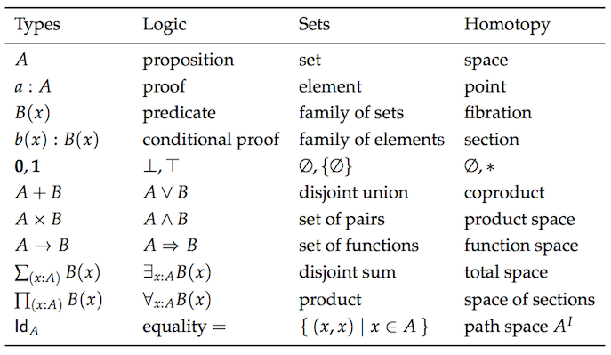
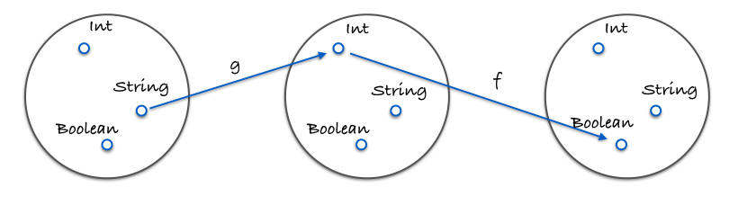

# Chapter 5: Coding by Composing

## Functional husbandry

Here's `compose`:

```js
var compose = function(f,g) {
  return function(x) {
    return f(g(x));
  };
};
```

`f` and `g` are functions and `x` is the value being "piped" through them.

Composition feels like function husbandry. You, breeder of functions, select two with traits you'd like to combine and mash them together to spawn a brand new one. Usage is as follows:

```js
var toUpperCase = function(x) { return x.toUpperCase(); };
var exclaim = function(x) { return x + '!'; };
var shout = compose(exclaim, toUpperCase);

shout("send in the clowns");
//=> "SEND IN THE CLOWNS!"
```

The composition of two functions returns a new function. This makes perfect sense: composing two units of some type (in this case function) should yield a new unit of that very type. You don't plug two legos together and get a lincoln log. There is a theory here, some underlying law that we will discover in due time.

In our definition of `compose`, the `g` will run before the `f`, creating a right to left flow of data. This is much more readable than nesting a bunch of function calls. Without compose, the above would read:

```js
var shout = function(x){
  return exclaim(toUpperCase(x));
};
```

Instead of inside to outside, we run right to left, which I suppose is a step in the left direction[^boo]. Let's look at an example where sequence matters:

```js
var head = function(x) { return x[0]; };
var reverse = reduce(function(acc, x){ return [x].concat(acc); }, []);
var last = compose(head, reverse);

last(['jumpkick', 'roundhouse', 'uppercut']);
//=> 'uppercut'
```

`reverse` will turn the list around while `head` grabs the initial item. This results in an effective, albeit inefficient, `last` function. The sequence of functions in the composition should be apparent here. We could define a left to right version, however, we mirror the mathematical version much more closely as it stands. That's right, composition is straight from the math books. In fact, perhaps it's time to look at a property that holds for any composition.

```js
// associativity
var associative = compose(f, compose(g, h)) == compose(compose(f, g), h);
// true
```

Composition is associative, meaning it doesn't matter how you group two of them. So, should we choose to uppercase the string, we can write:

```js
compose(toUpperCase, compose(head, reverse));

// or
compose(compose(toUpperCase, head), reverse);
```

Since it doesn't matter how we group our calls to `compose`, the result will be the same. That allows us to write a variadic compose and use it as follows:

```js
// previously we'd have to write two composes, but since it's associative, we can give compose as many fn's as we like and let it decide how to group them.
var lastUpper = compose(toUpperCase, head, reverse);

lastUpper(['jumpkick', 'roundhouse', 'uppercut']);
//=> 'UPPERCUT'


var loudLastUpper = compose(exclaim, toUpperCase, head, reverse)

loudLastUpper(['jumpkick', 'roundhouse', 'uppercut']);
//=> 'UPPERCUT!'
```

Applying the associative property gives us this flexibility and peace of mind that the result will be equivalent. The slightly more complicated variadic definition is included with the support libraries for this book and is the normal definition you'll find in libraries like [lodash][lodash-website], [underscore][underscore-website], and [ramda][ramda-website].

One pleasant benefit of associativity is that any group of functions can be extracted and bundled together in their very own composition. Let's play with refactoring our previous example:

```js
var loudLastUpper = compose(exclaim, toUpperCase, head, reverse);

// or
var last = compose(head, reverse);
var loudLastUpper = compose(exclaim, toUpperCase, last);

// or
var last = compose(head, reverse);
var angry = compose(exclaim, toUpperCase);
var loudLastUpper = compose(angry, last);

// more variations...
```

There's no right or wrong answers - we're just plugging our legos together in whatever way we please. Usually it's best to group things in a reusable way like `last` and `angry`. If familiar with Fowler's "[Refactoring][refactoring-book]", one might recognize this process as "[extract method][extract-method-refactor]"...except without all the object state to worry about.

## Pointfree

Pointfree style means never having to say your data. Excuse me. It means functions that never mention the data upon which they operate. First class functions, currying, and composition all play well together to create this style.

```js
//not pointfree because we mention the data: word
var snakeCase = function (word) {
  return word.toLowerCase().replace(/\s+/ig, '_');
};

//pointfree
var snakeCase = compose(replace(/\s+/ig, '_'), toLowerCase);
```

See how we partially applied `replace`? What we're doing is piping our data through each function of 1 argument. Currying allows us to prepare each function to just take its data, operate on it, and pass it along. Something else to notice is how we don't need the data to construct our function in the pointfree version, whereas in the pointful one, we must have our `word` available before anything else.

Let's look at another example.

```js
//not pointfree because we mention the data: name
var initials = function (name) {
  return name.split(' ').map(compose(toUpperCase, head)).join('. ');
};

//pointfree
var initials = compose(join('. '), map(compose(toUpperCase, head)), split(' '));

initials("hunter stockton thompson");
// 'H. S. T'
```

Pointfree code can again, help us remove needless names and keep us concise and generic. Pointfree is a good litmus test for functional code as it let's us know we've got small functions that take input to output. One can't compose a while loop, for instance. Be warned, however, pointfree is a double edge sword and can sometimes obfuscate intention. Not all functional code is pointfree and that is O.K. We'll shoot for it where we can and stick with normal functions otherwise.

## Debugging
A common mistake is to compose something like `map`, a function of two arguments, without first partially applying it.

```js
//wrong - we end up giving angry an array and we partially applied map with god knows what.
var latin = compose(map, angry, reverse);

latin(["frog", "eyes"]);
// error


// right - each function expects 1 argument.
var latin = compose(map(angry), reverse);

latin(["frog", "eyes"]);
// ["EYES!", "FROG!"])
```

If you are having trouble debugging a composition, we can use this helpful, but impure trace function to see what's going on.

```js
var trace = curry(function(tag, x){
  console.log(tag, x);
  return x;
});

var dasherize = compose(join('-'), toLower, split(' '), replace(/\s{2,}/ig, ' '));

dasherize('The world is a vampire');
// TypeError: Cannot read property 'apply' of undefined
```

Something is wrong here, let's `trace`

```js
var dasherize = compose(join('-'), toLower, trace("after split"), split(' '), replace(/\s{2,}/ig, ' '));
// after split [ 'The', 'world', 'is', 'a', 'vampire' ]
```

Ah! We need to `map` this `toLower` since it's working on an array.

```js
var dasherize = compose(join('-'), map(toLower), split(' '), replace(/\s{2,}/ig, ' '));

dasherize('The world is a vampire');

// 'the-world-is-a-vampire'
```

The `trace` function allows us to view the data at a certain point for debugging purposes. Languages like haskell and purescript have similar functions for ease of development.

Composition will be our tool for constructing programs and, as luck would have it, is backed by a powerful theory that ensures things will work out for us. Let's examine this theory.


## Category theory

Category theory is an abstract branch of mathematics that can formalize concepts from several different branches such as set theory, type theory, group theory, logic, and more. It primarily deals with objects, morphisms, and transformations, which mirrors programming quite closely. Here is a chart of the same concepts as viewed from each separate theory.



Sorry, I didn't mean to frighten you. I don't expect you to be intimately familiar with all these concepts. My point is to show you how much duplication we have so you can see why category theory aims to unify these things.

In category theory, we have something called... a category. It is defined as a collection with the following components:

  * A collection of objects
  * A collection of morphisms
  * A notion of composition on the morphisms
  * A distinguished morphism called identity

Category theory is abstract enough to model many things, but let's apply this to types and functions, which is what we care about at the moment.

**A collection of objects**
The objects will be data types. For instance, ``String``, ``Boolean``, ``Number``, ``Object``, etc. We often view data types as sets of all the possible values. One could look at ``Boolean`` as the set of `[true, false]` and ``Number`` as the set of all possible numeric values. Treating types as sets is useful because we can use set theory to work with them. 


**A collection of morphisms**
The morphisms will be our standard every day pure functions.

**A notion of composition on the morphisms**
This, as you may have guessed, is our brand new toy - `compose`. We've discussed that our `compose` function is associative which is no coincidence as it is a property that must hold for any composition in category theory.

Here is an image demonstrating composition:




Here is a concrete example in code:

```js
var g = function(x){ return x.length; };
var f = function(x){ return x === 4; };
var isFourLetterWord = compose(f, g);
```

**A distinguished morphism called identity**
Let's introduce a useful function called `id`. This function simply takes some input and spits it back at you. Take a look:

```js
var id = function(x){ return x; };
```

You might ask yourself "What in the bloody hell is that useful for?". We'll make extensive use of this function in the following chapters, but for now think of it as a function that can stand in for our value - a function masquerading as every day data.

`id` must play nicely with compose. Here is a property that always holds for every unary[^unary: a one argument function] function f:

```js
// identity
compose(id, f) == compose(f, id) == f;
// true
```

Hey, it's just like the identity property on numbers! If that's not immediately clear, take some time with it. Understand the futility. We'll be seeing `id` used all over the place soon, but for now we see it's a function that acts as a stand in for a given value. This is quite useful when writing pointfree code.

So there you have it, a category of types and functions. If this is your first introduction, I imagine you're still a little fuzzy on what a category is and why it's useful. We will build upon this knowledge throughout the book. As of right now, in this chapter, on this line, you can at least see it as providing us with some wisdom regarding composition - namely, the associativity and identity properties.

What are some other categories, you ask? Well, we can define one for directed graphs with nodes being objects, edges being morphisms, and composition just being path concatenation. We can define with Numbers as objects and `>=` as morphisms[^actually any partial or total order can be a category]. There are heaps of categories, but for the purposes of this book, we'll only concern ourselves with the one defined above. We have sufficiently skimmed the surface and must move on.


## In Summary
Composition connects our functions together like a series of pipes. Data will flow through our application as it must - pure functions are input to output after all so breaking this chain would disregard output, rendering our software useless.

We hold composition as a design principle above all others. This is because it keeps our app simple and reasonable. Category theory will play a big part in app architecture, modelling side effects, and ensuring correctness.

We are now at a point where it would serve us well to see some of this in practice. Let's make an example application.

[Chapter 6: Example Application](ch6.md)

## Exercises

```js
var _ = require('ramda');
var accounting = require('accounting');
  
// Example Data
var CARS = [
    {name: "Ferrari FF", horsepower: 660, dollar_value: 700000, in_stock: true},
    {name: "Spyker C12 Zagato", horsepower: 650, dollar_value: 648000, in_stock: false},
    {name: "Jaguar XKR-S", horsepower: 550, dollar_value: 132000, in_stock: false},
    {name: "Audi R8", horsepower: 525, dollar_value: 114200, in_stock: false},
    {name: "Aston Martin One-77", horsepower: 750, dollar_value: 1850000, in_stock: true},
    {name: "Pagani Huayra", horsepower: 700, dollar_value: 1300000, in_stock: false}
  ];

// Exercise 1:
// ============
// use _.compose() to rewrite the function below. Hint: _.prop() is curried.
var isLastInStock = function(cars) {
  var last_car = _.last(cars);
  return _.prop('in_stock', last_car);
};

// Exercise 2:
// ============
// use _.compose(), _.prop() and _.head() to retrieve the name of the first car
var nameOfFirstCar = undefined;


// Exercise 3:
// ============
// Use the helper function _average to refactor averageDollarValue as a composition
var _average = function(xs) { return _.reduce(_.add, 0, xs) / xs.length; }; // <- leave be

var averageDollarValue = function(cars) {
  var dollar_values = _.map(function(c) { return c.dollar_value; }, cars);
  return _average(dollar_values);
};


// Exercise 4:
// ============
// Write a function: sanitizeNames() using compose that returns a list of lowercase and underscored names: e.g: sanitizeNames(["Hello World"]) //=> ["hello_world"].

var _underscore = _.replace(/\W+/g, '_'); //<-- leave this alone and use to sanitize

var sanitizeNames = undefined;


// Bonus 1:
// ============
// Refactor availablePrices with compose.

var availablePrices = function(cars) {
  var available_cars = _.filter(_.prop('in_stock'), cars);
  return available_cars.map(function(x){
    return accounting.formatMoney(x.dollar_value);
  }).join(', ');
};


// Bonus 2:
// ============
// Refactor to pointfree. Hint: you can use _.flip()

var fastestCar = function(cars) {
  var sorted = _.sortBy(function(car){ return car.horsepower }, cars);
  var fastest = _.last(sorted);
  return fastest.name + ' is the fastest';
};
```

[lodash-website]: https://lodash.com/
[underscore-website]: http://underscorejs.org/
[ramda-website]: http://ramdajs.com/
[refactoring-book]: http://martinfowler.com/books/refactoring.html
[extract-method-refactor]: http://refactoring.com/catalog/extractMethod.html
